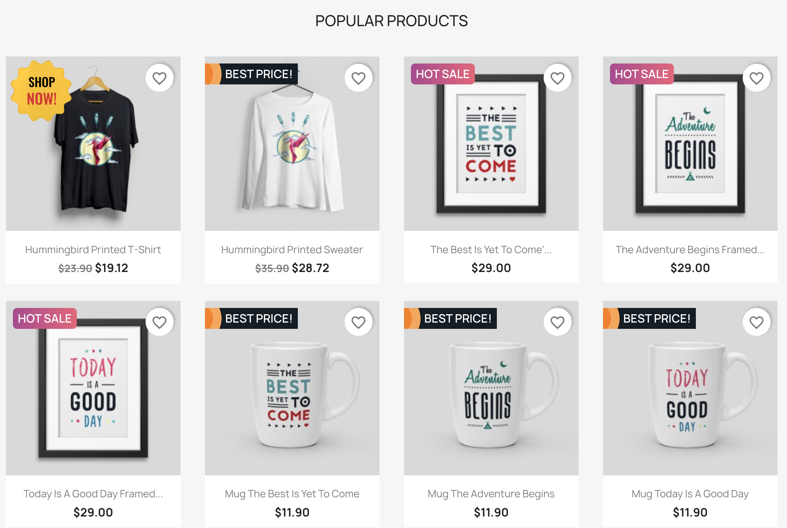
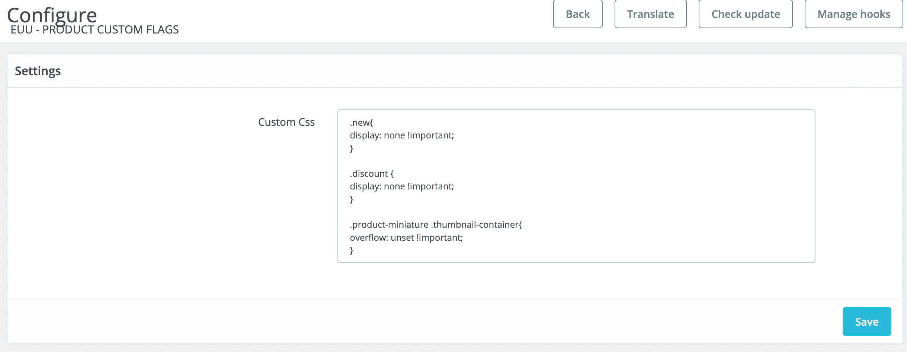
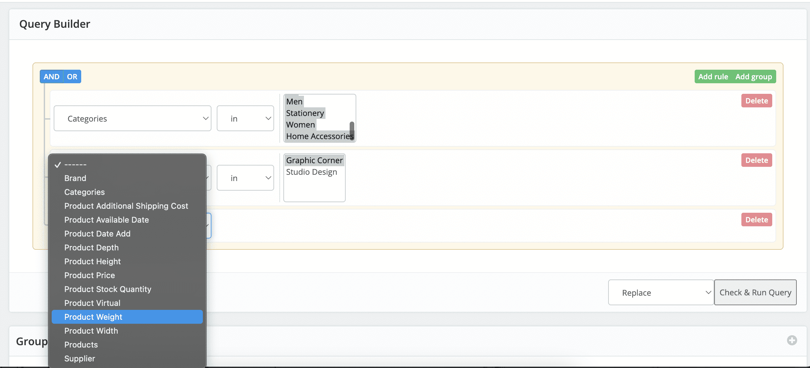
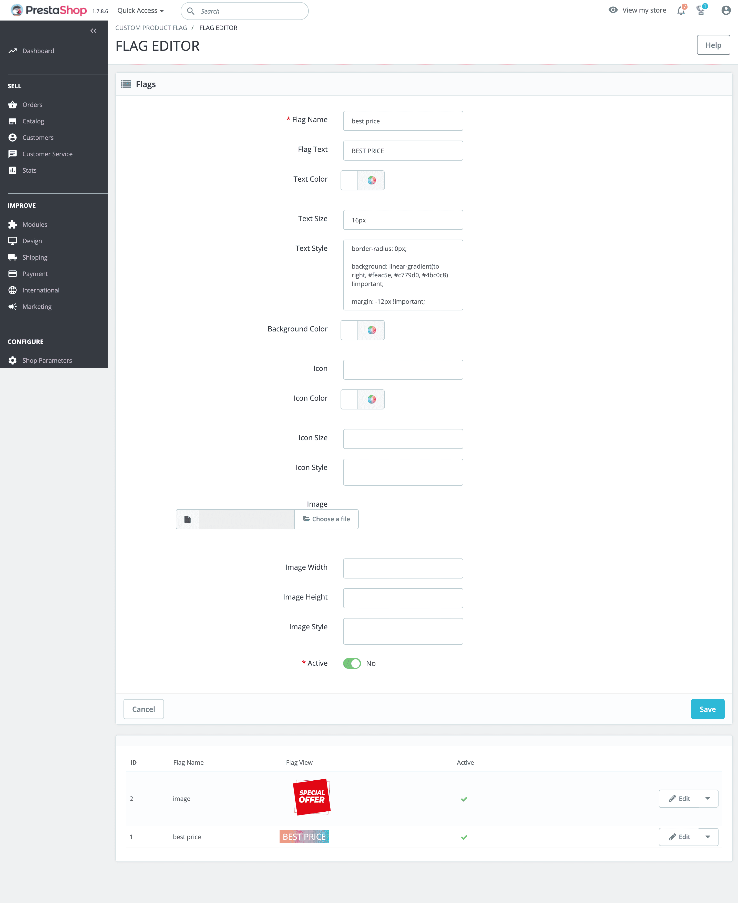
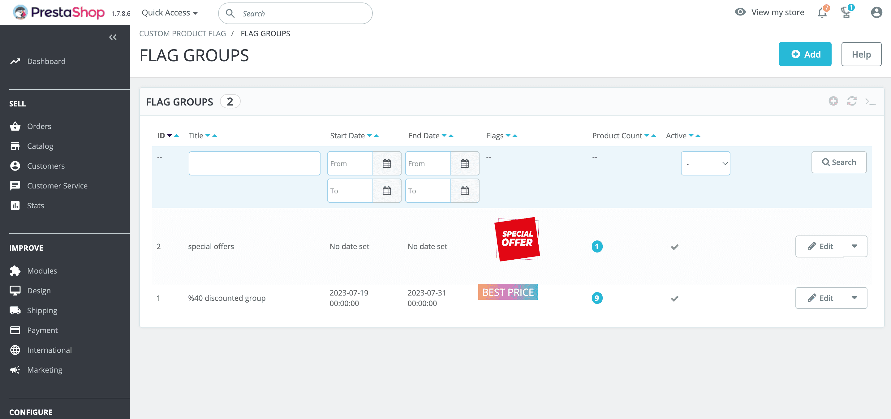
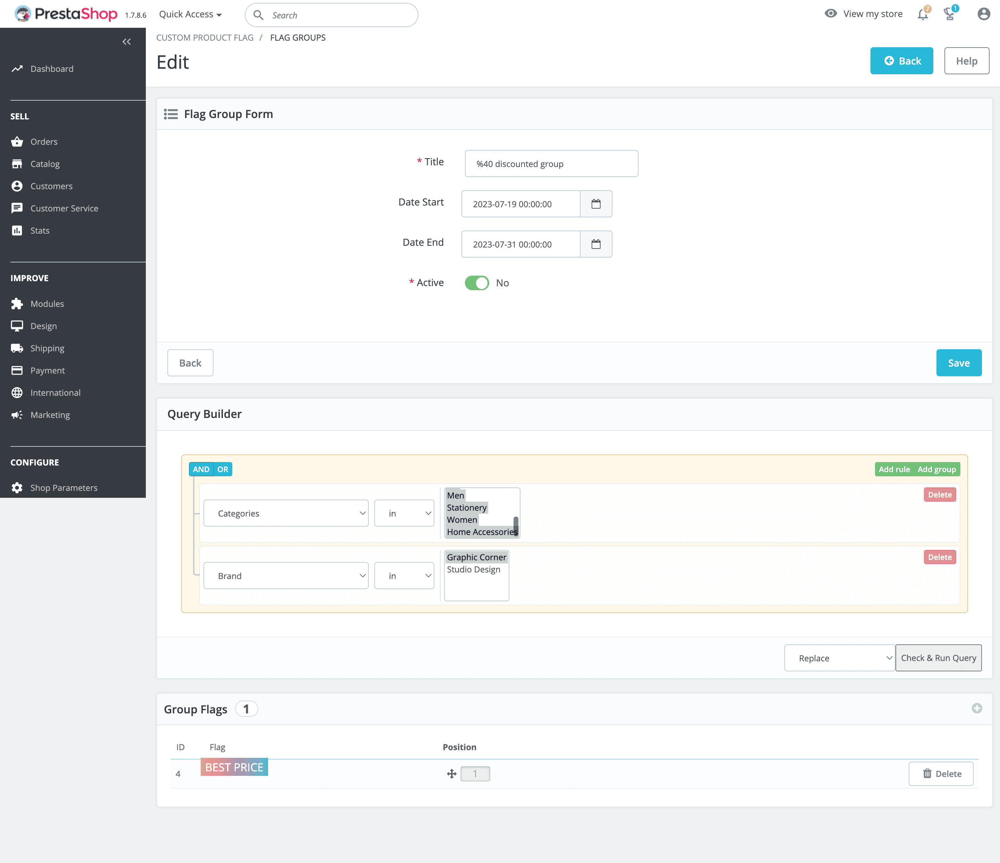
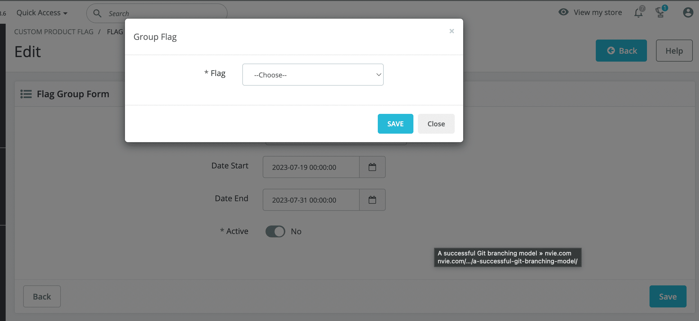
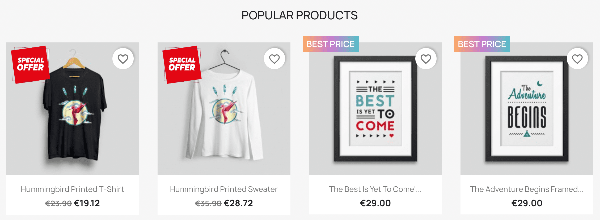

## Prestashop CustomFlag Module 

#### Hello and welcome to the CustomFlag module!

We are excited to introduce our CustomFlag module, designed to make your product catalogs visually appealing and attention-grabbing. This special module is perfect for Prestashop users, allowing you to add custom labels (also known as stickers or flags) to your product displays. These labels typically appear in the corners of product images and feature colorful, eye-catching text or graphics.

With CustomFlag, you can create unique labels for specific products or product groups, fully customizable to your liking. You can also set these labels to appear during specific time periods, allowing you to offer special deals and attract customers during campaigns or events.

The module supports custom CSS styles, enabling you to design labels that match your brand identity and make your products stand out. Additionally, the product group feature lets you assign multiple labels to filtered or selected products, creating a more personalized shopping experience.

CustomFlag provides easy product filtering, allowing you to categorize products based on price, category, quantity, and other attributes. This way, you can define custom labels for different product groups.

The CustomFlag module ensures efficient performance through caching and is compatible with Prestashop versions 1.7.6.9 and above, requiring PHP 7 or later.

Use CustomFlag to enhance your products with eye-catching labels, highlight your brand, guide your customers effectively, and boost your sales!

For more information, visit our website or contact us. The CustomFlag module is here to strengthen your Prestashop store and lead it to success!
***
#### Features
* Ability to create your own custom stickers.
* Write global CSS styles for active pages within the module.
* Easily adjust the activation status of stickers and sticker groups.
* Personalize stickers with images, icons, text, and custom CSS support.
* Define multiple stickers for each sticker group.
* Use a simple filter to select products and product groups for sticker groups.
* Set the date range for displaying sticker groups.
* Enjoy cache support for improved performance.
* Define unique text or images for stickers in multiple languages.
***
#### Requirements
* PHP version 7.2 or higher
* PrestaShop version 1.7.6.8 to 1.7.8.x (compatible with 1.7.6.8, 1.7.7.x, and 1.7.8.x)

### Images
* Good Flags 
* You can edit global css 
* Query Filters  
* Flag Editor 
* Flag Groups 
* Group Edit 
* Group Flag Add 
* Preview 

### Usage

#### Module Installation
1. Install the module from the zip file.

#### Display of Links
1. After a successful installation, "Flag Editor" and "Flag Groups" links will appear in the left menu.

#### Creating Flags
1. Go to the "Flag Editor" page.
2. Create the desired flag.

#### Flag Status
1. Ensure that the created flags are active and save the changes.
2. If successful, the added flags will be listed in the lower section.

#### Flag Groups
1. Navigate to the "Flag Groups" page.
2. Create a new group using the "Add" button in the upper right corner.

#### Editing a Group
1. Edit the created group using the "Edit" button.

#### Group Flags
1. On the group editing page, use the "+" button under "Group Flags" to add flags to the group.

#### Filter Settings
1. In the "Query Builder" section, specify in which products or filters the assigned flags will be valid.
2. Select the filter type on the left, and set the parameters on the right.

#### Filter Verification
1. Use "Check & Run Query" to verify in which products the flags are valid.
2. If confirmed, flags assigned to relevant products will be displayed.

#### Filter Modes
- "Replace": Clears the previous filter and applies the new filter.
- "Insert": Preserves the validity of the previous filter and adds new entries.
- "Delete": Removes flag appearances for products belonging to the specific filter.

#### Important Notes:
- CSS Rules: Remember to use `!important` when writing CSS rules.
- "new" and "discount" Flags: You can remove "new" and "discount" flags in Prestashop using the custom global CSS in module settings.
- Flag System: Flags store product validity based on filters. Update flags using "Replace" mode and "Check & Run Query" when there are changes in products.
